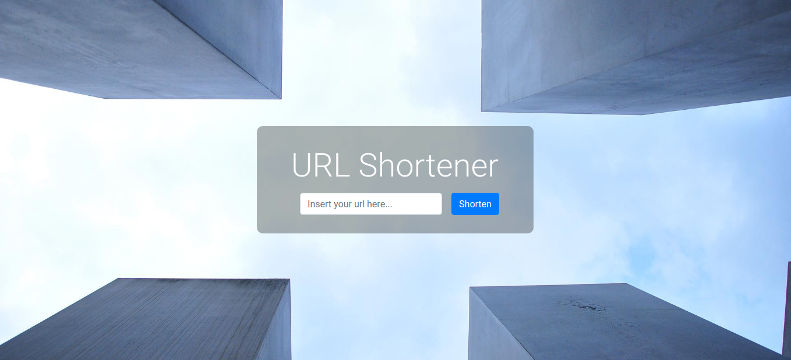
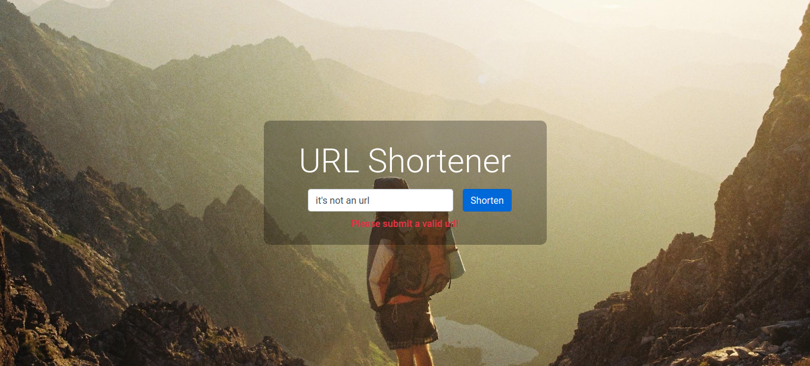

# URL Shortener

Url shortener made with python and django.

**Demo**

## Installation

First you need to install [Python 3.7+](https://www.python.org/downloads/) and Pip

> $ pip install -r requirements.txt (Install dependencies)

> $ python manage.py migrate (Create a simple sqlite3 db and migrate db structure)

> $ python manage.py createsuperuser (Create an admin user if you want manage anything)

## Usage

Run server with the following command:

> $ python manage.py runserver

Go to [http://localhost:8000](http://localhost:8000)
